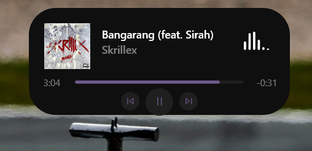
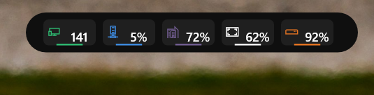

# Dynamic Island for Windows

A sleek, modern, and highly interactive Dynamic Island overlay for Windows. Built using pure C++ and Direct2D, this overlay provides seamless integration with your Windows system to display useful glanceable information and quick controls in a beautiful UI.

## ✨ Features

### 💤 Idle Condition
When not interacted with, the Dynamic Island elegantly shrinks into a sleek pill shape. It remains entirely click-through, ensuring it never interrupts your workflow.

The Dynamic Island features 5 powerful interactive views that you can scroll through using your mouse wheel while hovering over it:

### 🎵 Media Player
Displays your currently playing media, artist name, album art (via system transport controls), and a live progress bar. Includes playback controls (Previous, Play/Pause, Next) and allows scrubbing through the timeline.

### 📅 Calendar & Date
A clean and minimalistic view of the current date and a dynamic monthly calendar.

### ⛅ Weather Widget
Fetches real-time weather information (temperature, wind speed, and humidity) for your current location using the open-meteo API.

### 💻 Game Overlay
Keep an eye on your system's performance while Gaming showing real-time CPU, RAM, and Disk usage percentages tailored for Gamers.

### 🎛️ Control Center
Adjust your system volume and screen brightness instantly! Simply drag the smooth sliders and the changes are applied seamlessly.

## 🚀 Additional Features
- **Global Hotkey:** Instantly show or hide the island from anywhere using `Ctrl + Alt + D`.
- **System Tray Icon:** Easy access to quit or toggle the island directly from your taskbar.
- **Click-through & Auto-hide:** The island seamlessly blends into your workflow. The idle state is completely click-through, and smoothly expands when hovered.
- **Hardware Accelerated:** Built with Direct2D for buttery smooth 120 FPS animations and beautiful anti-aliased graphics.

## 🛠️ Build Instructions
This project uses pure Win32 API, Direct2D, and C++20.
1. Open the "x64 Native Tools Command Prompt for VS 2022"
2. Navigate to this directory
3. Run `build.bat`
4. Execute `DynamicIsland.exe`
